```julia
using Revise
using StatsPlots, UnROOT, StatsBase, CategoricalArrays, Polynomials, LinearAlgebra
using FHist, LaTeXStrings, MPThemes, DataFrames, DataFramesMeta, Distributions
```


```julia
ENV["COLUMNS"] = 2000
ENV["LINES"] = 20
```


    20


Custom functions are placed in the MiscFuncs.jl file.


```julia
include("MiscFuncs.jl")
using .MiscFuncs
```


```julia
gr()
my_vibrant(;
    size           = (800, 600),
    legend         = :outertopleft,
    guidefontsize  = 12,
    tickfontsize   = 12,
    titlefontsize  = 12,
    legendfontsize = 10,
    left_margin    = 4Plots.mm,
    right_margin   = 4Plots.mm,
    top_margin     = 4Plots.mm,
    bottom_margin  = 4Plots.mm,
    dpi            = 200,
);
```


```julia
baseDir = "/home/shoram/Work/PhD_Thesis/Job15/AngularCorrelations/"
```


    "/home/shoram/Work/PhD_Thesis/Job15/AngularCorrelations/"


```julia
f = ROOTFile(
    baseDir*"AngularCorrelationAllEnergies96MilEvents.root",
);
tree = DataFrame(LazyTree(f, "tree", keys(f["tree"])));
f= nothing; # free file from memory with gc

```

### ``@transform`` adds a column ``:ESum`` to the ``tree`` which contains the sum of the electron energies


```julia
@transform! tree :ESum = :reconstructedEnergy2 + :reconstructedEnergy1;
```

### Initializing constants.


```julia

dEmitted = 5 # dθdif in degrees
nBins    = Int(180 / dEmitted)
minAngle = 0
maxAngle = 180
binWidth = maxAngle / nBins

minEnergy = 500
maxEnergy = 3500
dEnergy   = 500

xPts = minAngle:dEmitted:maxAngle-dEmitted
```


    0:5:175


```julia
colors = [palette(:seaborn_bright)[i] for i in 1:length(palette(:seaborn_bright))];
```

### The 2d Histogram of ``ϕ`` vs ``θ`` is defined to be ``f(ϕ, θ)``. For each combination of ``ϕ`` and ``θ``, the bin number is obtained as functional value of ``f(ϕ, θ)``.


```julia
fh2d = Hist2D(                                           # h2d object similar to TH2D from ROOT
(tree.thetaEmitted, tree.thetaEscaped),      
(minAngle:dEmitted:maxAngle, minAngle:dEmitted:maxAngle), 
) 

h2d1 = histogram2d(
    tree.thetaEmitted,
    tree.thetaEscaped;
    nbins        = (nBins, nBins),
    xlabel       = "θemitted -> θ",
    ylabel       = "θescaped -> ϕ",
    legend       = :topright,
    title        = string("f(ϕ, θ): θesc vs θemit, ", nrow(tree), " entries"),
    lims         = (0, 180),
    aspect_ratio = 1,
)

```


    
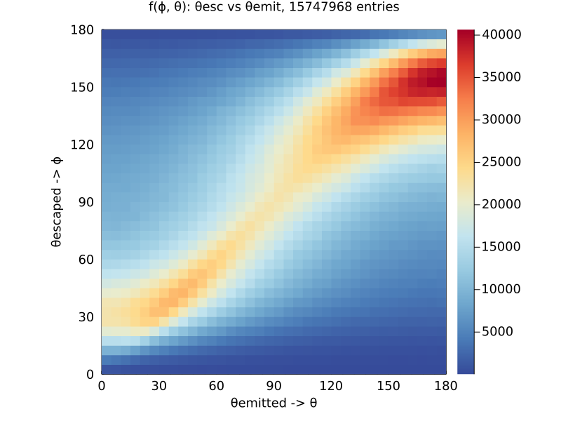
    


```julia
savefig(h2d1, joinpath(baseDir, string("h2d.png")))
```

### We define a line: ``ϕ - θ - k = 0`` with factor ``k`` which representing a diagonal line of ``f(ϕ, θ)``. Where:
1. ``k = 0`` represents the line ``ϕ = θ``. In other words, the escaped angle is same as emitted.
2. ``k < 0`` represents the lines where ``ϕ < θ``. Escaped underestimates emitted.
3. ``k > 0`` represents the lines where ``ϕ > θ``. Escaped underestimates emitted.


```julia
plot!(xPts, xPts .+ 30, label = "k = +30", lw = 5)
plot!(xPts, xPts, label = "k = 0", lw = 5)
plot!(xPts, xPts .- 30, label = "k = -30", lw = 5)
```


    
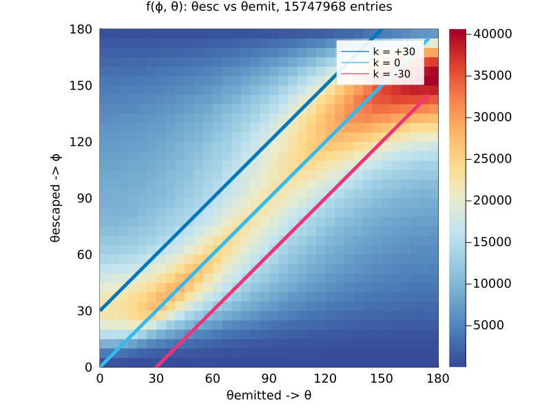
    


### Next we define function ``g(k)`` representing the integral over the diagonal bins of the lines ``k``


```julia
gs1 = get_diagonal_sums(fh2d)
ks1 = get_k_factors(fh2d);
```


```julia
gk1 = plot(ks1 .* dEmitted, gs1, legend=:topright, xlims=(-179, 179), xlabel="k-factor", ylabel="g(k)", label="g₁(k)")
```


    
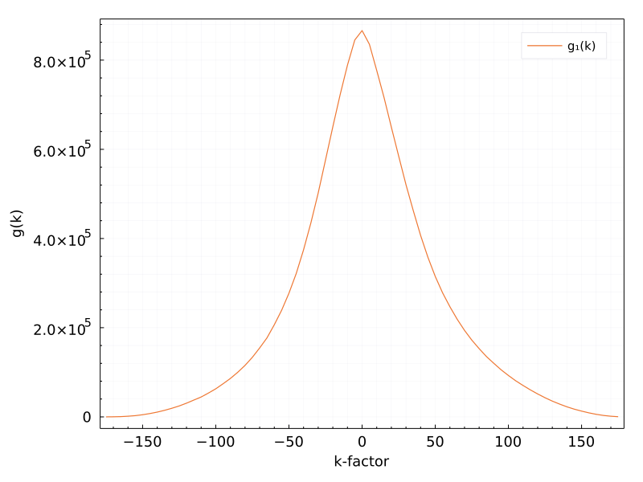
    


### Applying various data cuts, we can observe how ``g(k)`` behaves. For example, if we apply an energy cut for the sum of electron energies, ie. $E \in (3000, 3500)keV$  we get...


```julia
gdf = @chain tree begin
    @subset((3000 .<= :ESum .<= 3500))
    @select(:thetaEscaped, :thetaEmitted, :ESum)
end

fh2d = Hist2D(                                           # h2d object similar to TH2D from ROOT
(gdf[!,2], gdf[!,1]),      
(minAngle:dEmitted:maxAngle, minAngle:dEmitted:maxAngle), 
) 

histogram2d(gdf[!,2], gdf[!,1];
    nbins        = (nBins, nBins),
    xlabel       = "θemitted -> θ",
    ylabel       = "θescaped -> ϕ",
    legend       = :topright,
    title        = string("f(ϕ, θ): E ∈ (3000, 3500)keV, ", nrow(gdf), " entries"),
    lims         = (0, 180),
    aspect_ratio = 1,)


```


    
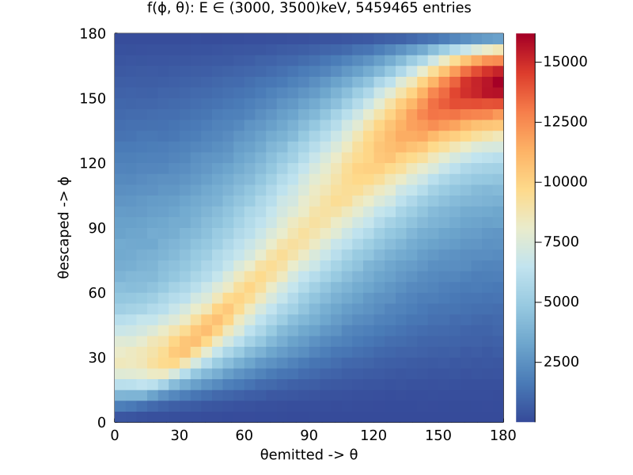
    


### And the corresponding ``g(k)`` is 


```julia
gs2 = get_diagonal_sums(fh2d)
ks2 = get_k_factors(fh2d);
```


```julia
plot!(gk1, ks2  .* dEmitted, gs2, legend=:topright, xlims=(-179, 179), xlabel="k-factor", ylabel="g(k)", label="g₂(k), E ∈ (3000,3500)")
```


    
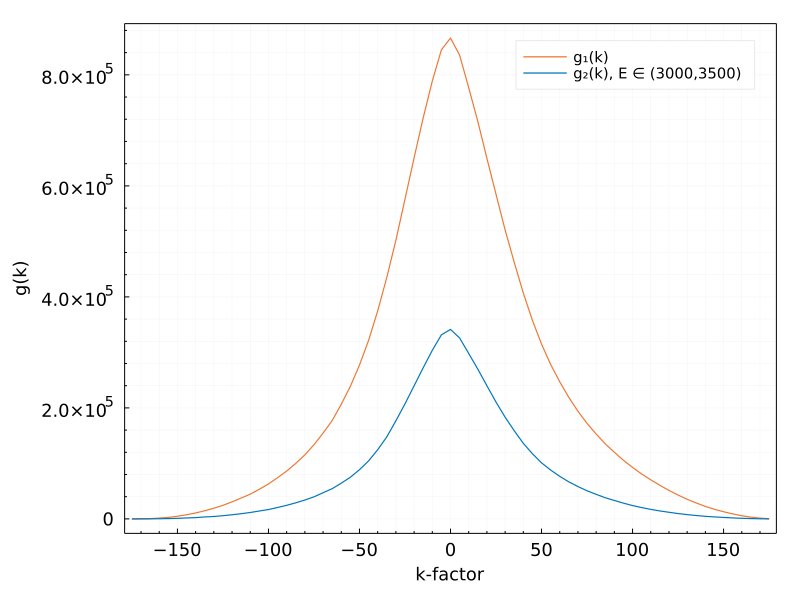
    


### The first thing to notice is the reduced statistics. (For obvious reasons.) The more interesting however, is to look at the dispersion around the k = 0 line. Ideally, the statistics would be sacrified for the improved reconstruction precision -> narrower g(k). This we can view better by looking at $g_1(k), g_2(k)$ normalized by their maximum.  


```julia
gMax1 = maximum(gs1)
gMax2 = maximum(gs2)
plot(ks1  .* dEmitted, gs1 ./ gMax1, legend=:topright, xlims=(-179, 179), xlabel="k-factor", ylabel="g(k)", label="g₁(k)_relative")
plot!(ks2 .* dEmitted, gs2 ./ gMax2, legend=:topright, xlims=(-179, 179), xlabel="k-factor", ylabel="g(k)", label="g₂(k)_relative")
```


    
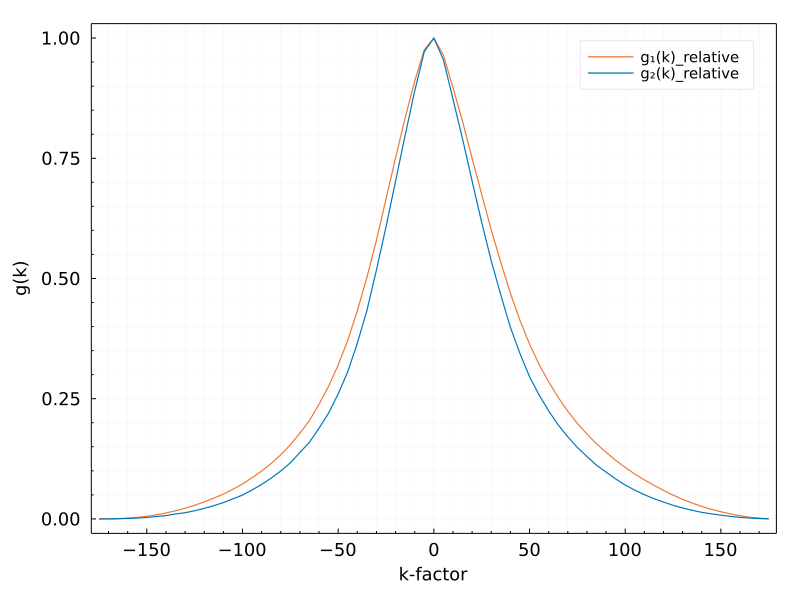
    


### We can see that while applying an energy cut on the data results in decreased statistics, it did provide for a better reconstruction precision. We thus have a tool for comparing the effects of data cuts on the data.

### Next we look more in detail at individual $\phi$ slices. We first slice up ``f(ϕ, θ)`` horizontally in slices of $d\phi$ = $5\deg$. We look at the ``g(k)``s of the individual slices. I.e. a horizontal slice with $\phi \in (0, 5)\deg$ and its $g(k)$ would look as:


```julia
gdf = @chain tree begin
    @subset((0 .<= :thetaEscaped .<= 5))
    @select(:thetaEscaped, :thetaEmitted)
end

fh2d = Hist2D(                                           # h2d object similar to TH2D from ROOT
(gdf[!,2], gdf[!,1]),      
(minAngle:dEmitted:maxAngle, minAngle:dEmitted:maxAngle), 
) 

gs4 = get_diagonal_sums(fh2d)
ks4 = get_k_factors(fh2d);

h = histogram2d(gdf[!,2], gdf[!,1];
    nbins        = (nBins, nBins),
    xlabel       = "θemitted -> θ",
    ylabel       = "θescaped -> ϕ",
    legend       = :topright,
    title        = string("f(ϕ, θ): dϕ ∈ (0, 5)°, ", nrow(gdf), " entries"),
    lims         = (0, 180),
    # aspect_ratio = 1,
    )
p = plot(ks4, gs4, label = "")

l = @layout [a{0.4w} b]
plot(h,p, layout = l)
```


    
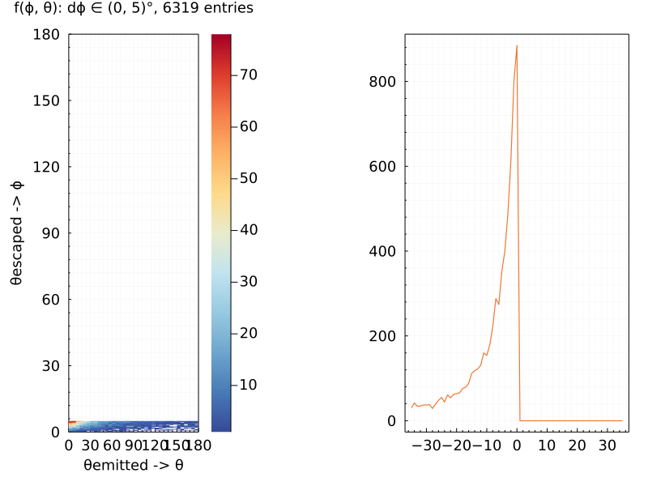
    


### Repeating this procedure, slicing $f(\phi, \theta)$ horizontally to cover the whole 0 - 180 degree range yields:


```julia
dϕ = 5                      # step in ϕ
sign = "p"                  # sign in get_cut_edges function
maxSteps = Int(180 / dϕ)    # max number of steps (slices)
```


    36


### Initialize arrays to hold the g(k) integrals. One g(k) is obtained for each horizontal slice.

### We can look at the individual lines of ``g(k)``


```julia
dfGOrig = get_gs_df(tree, dϕ, sign)
matGOrig = df_to_mat(dfGOrig);
```


```julia
p = plot()
lbls = names(dfGOrig)
for i in 2:ncol(dfGOrig)-1
    plot!(dfGOrig.k, dfGOrig[!,i+1], label = lbls[i])
end
p

```


    
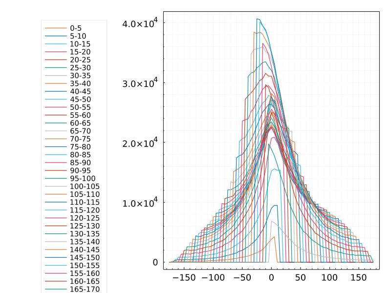
    


### Not much to see in this example. So many lines are difficult to decipher. However, if one were to look at the individual $d\phi$ cuts as a new dimension, we can look at the graph in the plane of $(k, d\phi)$ with z-direction being the value of $g(k, d\phi)$. 


```julia
xRange = dϕ-180:dϕ:180-dϕ
yRange = 0:dϕ:180-dϕ
sf1 = surface(xRange, yRange,  matGOrig, legend =:none, xlabel ="k", ylabel ="dϕ", zlabel="g(k, dϕ)")
hm1 =contourf(xRange, yRange,  matGOrig, ylabel ="dϕ", xlabel ="k" )
vline!([0], label ="")
plot(sf1,hm1, size =(1000,400), layout = @layout [a{0.4w} b])
```


    
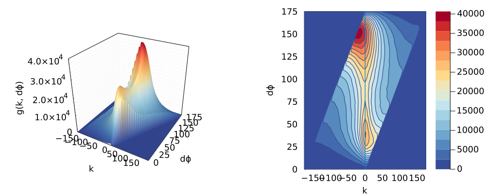
    


### Now we can see a few important features. First of all, there are two peaks visible in the left figure, with the higher peak (more statistics) being in the region of $130 < \phi < 170$ . Secondly,  we can see the deviation of the peaks from the `` k = 0`` line in the right figure. There are two hotspots visible. First hotspot (corresponding to the lower peak in  figure) is centered around $d\phi \approx 30 \deg$ and is shifted slightly to the right of the ``k = 0`` line. The escaped angle overestimates the emitted angle. Second hotspot (corresponding to the higher peak in figure) is centered around $d\phi \approx 150 \deg$ and is shifted visibly to the left of the ``k = 0`` line. The escaped angle underestimates the emitted angle. Lastly, we can see that the regions $\phi \approx 0 \deg$ and $\phi \approx 180 \deg$ are squeezed toward higher, lower angles, respectively. 

### Ideally, we would want to have the peaks centered around the ``k=0`` line. To do that, we can perform justified manipulation of $\phi$ in terms of shifting the entire row ($d\phi$ slice) to the right or left by some set amount ``s`` [$s \in (-180,180)$]. The new (modified) angle is defined as $\phi' = \phi + s$. This will, inevitably, reduce the obtained statistics (if an angle is shifted toward unphysical values, ie. $\phi >180$), however if better precision is achieved, it may be worthwile. In the first case, let's try to shift each row by the mean value in that row, so that the mean is centered at ``k=0``. To determine whether this gives us better or worse result, we compare the rms value of each slice before and after shifting.  


```julia
shiftPoints = [get_gs_mean(dfGOrig[:,i], dfGOrig[:,1]) for i in 2:ncol(dfGOrig) ]      # find mean of each g(k) and save in vector

scatter(xPts, shiftPoints, xlabel = "dϕ", ylabel = "mean", legend =:topleft, label ="s = k_mean" )

```


    
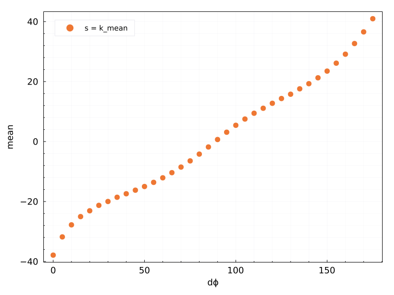
    


```julia
modTree = @chain tree begin
    @select(:thetaEmitted, :thetaEscaped)
    @rtransform :bin =  get_bin_center(:thetaEscaped, Int(180/dϕ)) 

    @rtransform :thetaEscaped = :thetaEscaped + shiftPoints[Int(ceil(:bin/dϕ))]
    @subset( 0 .< :thetaEscaped .< 180)
end
```


<div class="data-frame"><p>13,759,406 rows × 3 columns</p><table class="data-frame"><thead><tr><th></th><th>thetaEmitted</th><th>thetaEscaped</th><th>bin</th></tr><tr><th></th><th title="Float64">Float64</th><th title="Float64">Float64</th><th title="Float64">Float64</th></tr></thead><tbody><tr><th>1</th><td>89.6031</td><td>95.3077</td><td>92.5</td></tr><tr><th>2</th><td>96.965</td><td>157.081</td><td>137.5</td></tr><tr><th>3</th><td>154.233</td><td>155.971</td><td>137.5</td></tr><tr><th>4</th><td>67.3403</td><td>177.772</td><td>152.5</td></tr><tr><th>5</th><td>11.2133</td><td>38.079</td><td>52.5</td></tr><tr><th>6</th><td>168.417</td><td>76.8998</td><td>82.5</td></tr><tr><th>7</th><td>122.632</td><td>59.2241</td><td>67.5</td></tr><tr><th>8</th><td>4.96695</td><td>14.9949</td><td>32.5</td></tr><tr><th>9</th><td>79.857</td><td>49.0303</td><td>62.5</td></tr><tr><th>10</th><td>43.0942</td><td>14.005</td><td>32.5</td></tr><tr><th>11</th><td>35.1387</td><td>109.492</td><td>102.5</td></tr><tr><th>12</th><td>150.65</td><td>107.346</td><td>102.5</td></tr><tr><th>13</th><td>56.3877</td><td>42.0529</td><td>57.5</td></tr><tr><th>14</th><td>128.995</td><td>95.5156</td><td>92.5</td></tr><tr><th>15</th><td>63.2692</td><td>23.5382</td><td>42.5</td></tr><tr><th>16</th><td>40.4733</td><td>41.5374</td><td>57.5</td></tr><tr><th>17</th><td>124.468</td><td>162.065</td><td>142.5</td></tr><tr><th>18</th><td>142.67</td><td>121.997</td><td>112.5</td></tr><tr><th>19</th><td>68.2757</td><td>77.436</td><td>82.5</td></tr><tr><th>20</th><td>143.694</td><td>169.719</td><td>147.5</td></tr><tr><th>&vellip;</th><td>&vellip;</td><td>&vellip;</td><td>&vellip;</td></tr></tbody></table></div>


```julia
nrow(modTree)/nrow(tree)
```


    0.8737258038624411


```julia
dfG2 = get_gs_df(modTree, dϕ, sign)
matG2 = df_to_mat(dfG2);
```


```julia
h2d2 = histogram2d(modTree.thetaEmitted, modTree.thetaEscaped,
    nbins        = (nBins, nBins),
    xlabel       = "θ",
    ylabel       = "ϕ'",
    legend       = :topright,
    title        = string("f(ϕ, θ), ", nrow(modTree), " entries"),
    lims         = (0, 180),
    aspect_ratio = 1,)
plot!(xPts, xPts, label ="")
```


    
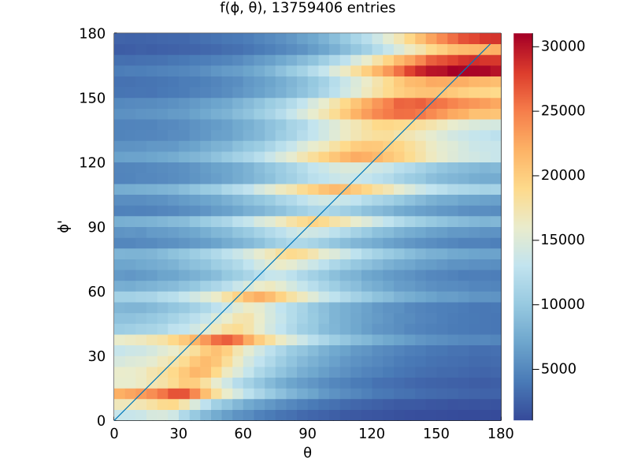
    


### We can see that the hotspots are shifted, and slightly closer to the ``k=0`` line (qualitatively). The statistics is reduced to $\sim 87\%$. The seemingle discrete distribution is due to the fact that each slice has been shifted by a discrete number and this has shifted some angles toward certain slices more, or less. To view the effects of the shift, let's compare the 2d histograms, contour plots and the rms values for the two datasets. 


```julia
rms1 = [ get_rms(dfGOrig[:,i], dfGOrig[:,1]) for i in 2:ncol(dfGOrig) ]

sct1 = scatter( xPts, rms1, label ="rms(dϕ)", ms=2, legend=:top, xlabel ="dϕ slice", ylabel ="rms" )

# plot(title, h2d1, hm1, sct1, layout = @layout[a{0.05h};b c; d _] , size = (1100, 800))
plot(h2d1, hm1, sct1, layout = @layout[a b; c _] , size = (1200, 800), plot_title= "Unmodified angles")
```


    
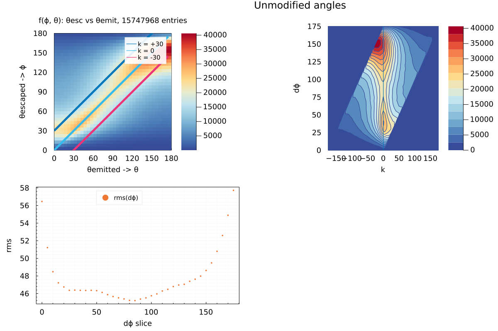
    


```julia
hm2 =contourf(xRange, yRange,  matG2, ylabel ="dϕ'", xlabel ="k" )
vline!([0], label ="")

rms2 = [ get_rms(dfG2[:,i], dfG2[:,1]) for i in 2:ncol(dfG2) ]

sct2 = scatter( xPts, rms2, label ="rms(dϕ')", ms=2, legend=:top, xlabel ="dϕ' slice", ylabel ="rms" )


plot(h2d2, hm2, sct2, layout = @layout[a b; c _] , size = (1200, 800), plot_title= "Modified by mean angles")
```


    
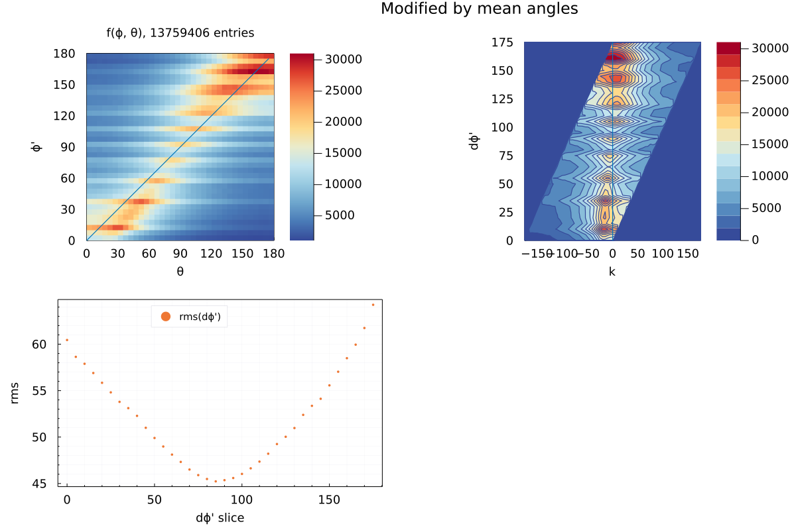
    


```julia
scatter( [xPts xPts], [rms1 rms2],  label =["rms₁(dϕ)" "rms₂(dϕ)"], ms=3, legend=:top, xlabel ="dϕ slice", ylabel ="rms")
```


    
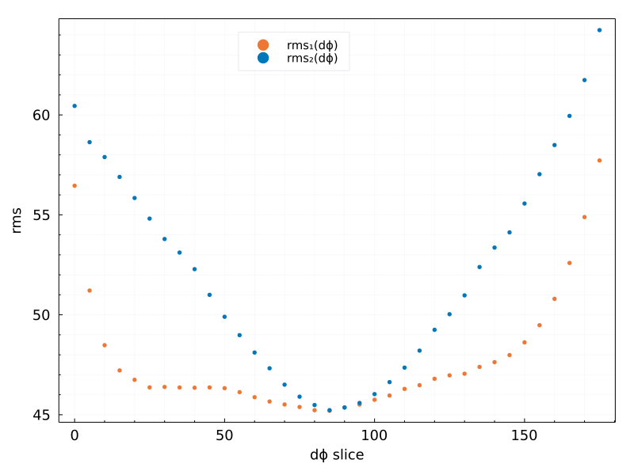
    


```julia
RMS1, S1 = get_rms_set(tree, dϕ);
```


```julia
minRMS = get_min_rms(RMS1)
minShifts = get_min_shifts(S1, RMS1);
```


```julia
scatter( [xPts xPts], [rms1 minRMS],  label =["rms₁(dϕ)" "rms₃(dϕ')"], ms=3, legend=:top, xlabel ="dϕ slice", ylabel ="rms")

```


    
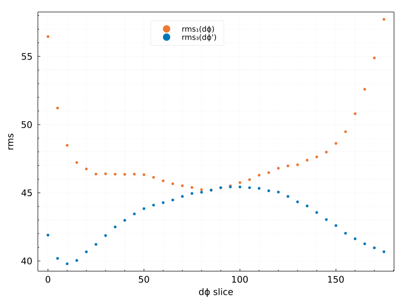
    


```julia
modes = [ dfGOrig[argmax(dfGOrig[:,i]), 1] for i in 2:ncol(dfGOrig)];
```


```julia
contourf(xRange, yRange,  matGOrig , c=:greys, xlims=(minimum(dfGOrig[:,1]), maximum(dfGOrig[:,1])), ylims=(0, 180), )
scatter!( minShifts, xPts, label = "s = minimized rms", ms =3 )
scatter!( modes, xPts, label = "s = modes" , ms =3 )
scatter!( shiftPoints, xPts, label ="s = mean", legend =:right, xlabel ="k-factor, s = k_max", ylabel="dϕ" , ms =3 )


```


    
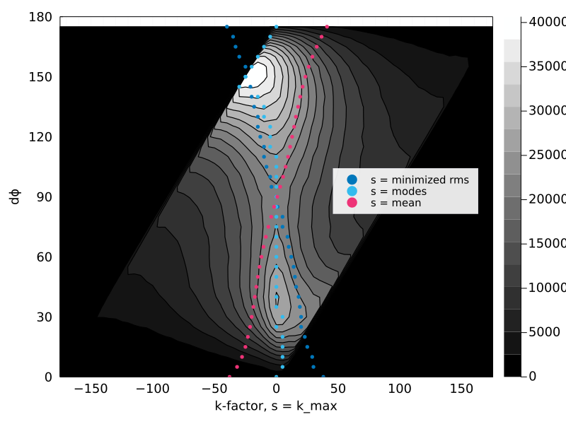
    


```julia
scatter( S, RMS, ms =6, label = reshape(lbls[2:end], 1, length(lbls[2:end])), 
xlabel = "s", ylabel = "rms", c= :skyblue, grid=:off, legend =:none, frame =:none, minorgrid=:off, alpha = 0.1,
marker = :square )

```


    UndefVarError: S not defined

    

    Stacktrace:

     [1] top-level scope

       @ In[37]:1

     [2] eval

       @ ./boot.jl:360 [inlined]

     [3] include_string(mapexpr::typeof(REPL.softscope), mod::Module, code::String, filename::String)

       @ Base ./loading.jl:1094


```julia
minShifts = reverse(minShifts);
```


```julia
modTree = @chain tree begin
    @select(:thetaEmitted, :thetaEscaped)
    @transform :thetaEscapedOld = :thetaEscaped
    @rtransform :bin =  get_bin_center(:thetaEscaped, Int(180/dϕ)) 

    @rtransform :thetaEscaped = :thetaEscaped + minShifts[Int(ceil(:bin/dϕ))]
    @subset( 0 .< :thetaEscaped .< 180)
end
```


<div class="data-frame"><p>13,867,524 rows × 4 columns</p><table class="data-frame"><thead><tr><th></th><th>thetaEmitted</th><th>thetaEscaped</th><th>thetaEscapedOld</th><th>bin</th></tr><tr><th></th><th title="Float64">Float64</th><th title="Float64">Float64</th><th title="Float64">Float64</th><th title="Float64">Float64</th></tr></thead><tbody><tr><th>1</th><td>89.6031</td><td>95.6325</td><td>94.6325</td><td>92.5</td></tr><tr><th>2</th><td>96.965</td><td>157.497</td><td>139.497</td><td>137.5</td></tr><tr><th>3</th><td>154.233</td><td>156.388</td><td>138.388</td><td>137.5</td></tr><tr><th>4</th><td>67.3403</td><td>174.281</td><td>154.281</td><td>152.5</td></tr><tr><th>5</th><td>11.2133</td><td>38.0724</td><td>53.0724</td><td>52.5</td></tr><tr><th>6</th><td>168.417</td><td>77.0901</td><td>81.0901</td><td>82.5</td></tr><tr><th>7</th><td>122.632</td><td>59.6012</td><td>69.6012</td><td>67.5</td></tr><tr><th>8</th><td>4.96695</td><td>13.9839</td><td>34.9839</td><td>32.5</td></tr><tr><th>9</th><td>79.857</td><td>51.1214</td><td>61.1214</td><td>62.5</td></tr><tr><th>10</th><td>43.0942</td><td>12.994</td><td>33.994</td><td>32.5</td></tr><tr><th>11</th><td>35.1387</td><td>109.069</td><td>104.069</td><td>102.5</td></tr><tr><th>12</th><td>150.65</td><td>106.923</td><td>101.923</td><td>102.5</td></tr><tr><th>13</th><td>56.3877</td><td>42.6631</td><td>55.6631</td><td>57.5</td></tr><tr><th>14</th><td>128.995</td><td>95.8403</td><td>94.8403</td><td>92.5</td></tr><tr><th>15</th><td>63.2692</td><td>22.9504</td><td>40.9504</td><td>42.5</td></tr><tr><th>16</th><td>40.4733</td><td>42.1476</td><td>55.1476</td><td>57.5</td></tr><tr><th>17</th><td>124.468</td><td>161.771</td><td>142.771</td><td>142.5</td></tr><tr><th>18</th><td>142.67</td><td>122.558</td><td>112.558</td><td>112.5</td></tr><tr><th>19</th><td>68.2757</td><td>77.6263</td><td>81.6263</td><td>82.5</td></tr><tr><th>20</th><td>143.694</td><td>168.461</td><td>148.461</td><td>147.5</td></tr><tr><th>&vellip;</th><td>&vellip;</td><td>&vellip;</td><td>&vellip;</td><td>&vellip;</td></tr></tbody></table></div>


```julia
density(modTree.thetaEmitted,  label = "θ")
density!(modTree.thetaEscapedOld,  label = "ϕ")
density!(modTree.thetaEscaped, label="ϕ'")

```


    
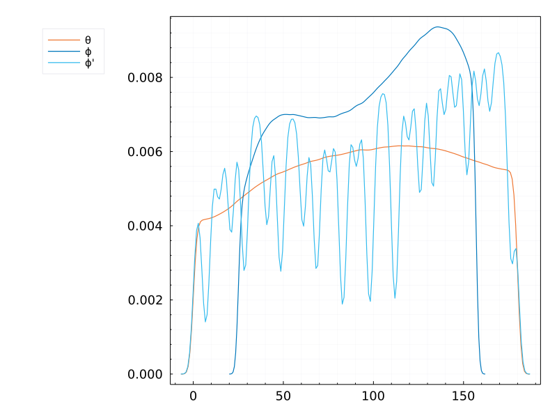
    


```julia

```
