# SNAngularCorrelation
```julia
using StatsPlots, UnROOT, StatsBase, CategoricalArrays
using FHist, LaTeXStrings, MPThemes, DataFrames, DataFramesMeta, Distributions
```


```julia
ENV["COLUMNS"] = 2000
ENV["LINES"] = 20
```


    20


Custom functions are placed in the MiscFuncs.jl file.


```julia
include("MiscFuncs.jl")
using .MiscFuncs
```


```julia
gr()
my_vibrant(;
    size           = (800, 600),
    legend         = :outertopleft,
    guidefontsize  = 12,
    tickfontsize   = 12,
    titlefontsize  = 12,
    legendfontsize = 10,
    left_margin    = 4Plots.mm,
    right_margin   = 4Plots.mm,
    top_margin     = 4Plots.mm,
    bottom_margin  = 4Plots.mm,
    dpi            = 200,
);
```


```julia
baseDir = "/home/shoram/Work/PhD_Thesis/Job15/AngularCorrelations/"
```


    "/home/shoram/Work/PhD_Thesis/Job15/AngularCorrelations/"


```julia
f = ROOTFile(
    baseDir*"AngularCorrelationAllEnergies96MilEvents.root",
);
tree = DataFrame(LazyTree(f, "tree", keys(f["tree"])));
f= nothing; # free file from memory with gc

```

### ``@transform`` adds a column ``:ESum`` to the ``tree`` which contains the sum of the electron energies


```julia
@transform! tree :ESum = :reconstructedEnergy2 + :reconstructedEnergy1;
```

### Initializing constants.


```julia

dEmitted = 5 # dθdif in degrees
nBins    = Int(180 / dEmitted)
minAngle = 0
maxAngle = 180
binWidth = maxAngle / nBins

minEnergy = 500
maxEnergy = 3500
dEnergy   = 500

xPts = minAngle:dEmitted:maxAngle-dEmitted
```


    0:5:175


```julia
colors = [palette(:seaborn_bright)[i] for i in 1:length(palette(:seaborn_bright))];
```

### The 2d Histogram of ``ϕ`` vs ``θ`` is defined to be ``f(ϕ, θ)``. For each combination of ``ϕ`` and ``θ``, the bin number is obtained as functional value of ``f(ϕ, θ)``.


```julia
fh2d = Hist2D(                                           # h2d object similar to TH2D from ROOT
(tree.thetaEmitted, tree.thetaEscaped),      
(minAngle:dEmitted:maxAngle, minAngle:dEmitted:maxAngle), 
) 

h2d = histogram2d(
    tree.thetaEmitted,
    tree.thetaEscaped;
    nbins        = (nBins, nBins),
    xlabel       = "θemitted -> θ",
    ylabel       = "θescaped -> ϕ",
    legend       = :topright,
    title        = string("f(ϕ, θ): θesc vs θemit, ", nrow(tree), " entries"),
    lims         = (0, 180),
    aspect_ratio = 1,
)

```


    
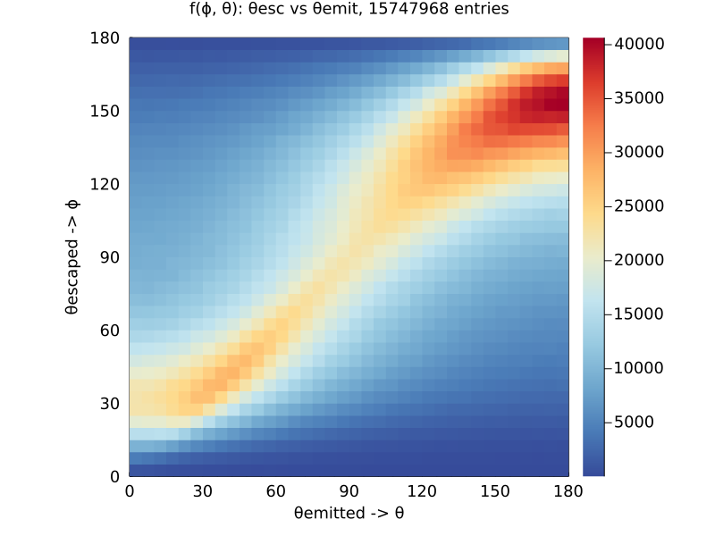
    


```julia
savefig(h2d, joinpath(baseDir, string("h2d.png")))
```

### We define a line: ``ϕ - θ - k = 0`` with factor ``k`` which representing a diagonal line of ``f(ϕ, θ)``. Where:
1. ``k = 0`` represents the line ``ϕ = θ``. In other words, the escaped angle is same as emitted.
2. ``k < 0`` represents the lines where ``ϕ < θ``. Escaped underestimates emitted.
3. ``k > 0`` represents the lines where ``ϕ > θ``. Escaped underestimates emitted.


```julia
plot!(xPts, xPts, label = "k = 0", lw = 5)
plot!(xPts, xPts .+ 30, label = "k = +30", lw = 5)
plot!(xPts, xPts .- 30, label = "k = -30", lw = 5)
```


    
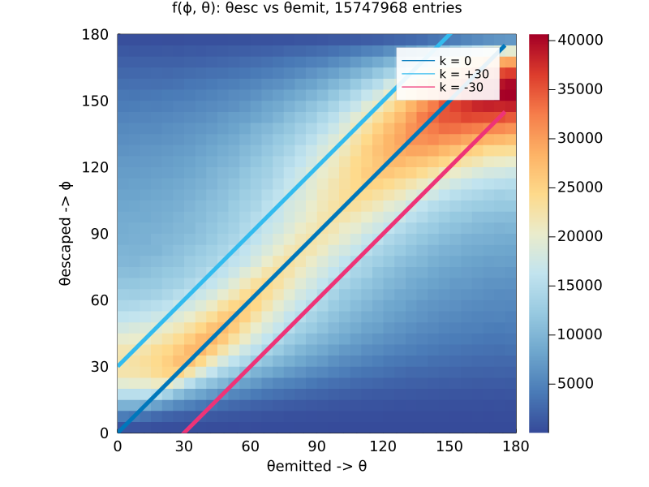
    


### Next we define function ``g(k)`` representing the integral over the diagonal bins of the lines ``k``


```julia
gs1 = get_diagonal_sums(fh2d)
ks1 = get_k_factors(fh2d);
```


```julia
gk1 = plot(ks1 .* dθ, gs1, legend=:topright, xlims=(-179, 179), xlabel="k-factor", ylabel="g(k)", label="g₁(k)")
```


    
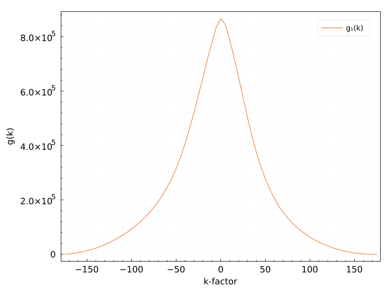
    


### Applying various data cuts, we can observe how ``g(k)`` behaves. For example, if we apply an energy cut for the sum of electron energies, ie. $E \in (3000, 3500)keV$ `` we get...


```julia
gdf = @chain tree begin
    @subset((3000 .<= :ESum .<= 3500))
    @select(:thetaEscaped, :thetaEmitted, :ESum)
end

fh2d = Hist2D(                                           # h2d object similar to TH2D from ROOT
(gdf[!,2], gdf[!,1]),      
(minAngle:dEmitted:maxAngle, minAngle:dEmitted:maxAngle), 
) 

histogram2d(gdf[!,2], gdf[!,1];
    nbins        = (nBins, nBins),
    xlabel       = "θemitted -> θ",
    ylabel       = "θescaped -> ϕ",
    legend       = :topright,
    title        = string("f(ϕ, θ): E ∈ (3000, 3500)keV, ", nrow(gdf), " entries"),
    lims         = (0, 180),
    aspect_ratio = 1,)


```


    
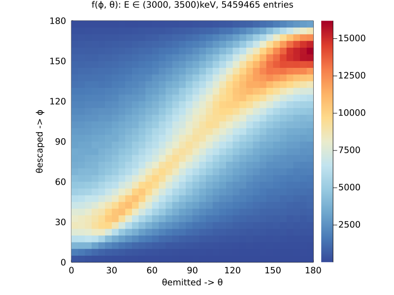
    


### And the corresponding ``g(k)`` is 


```julia
gs2 = get_diagonal_sums(fh2d)
ks2 = get_k_factors(fh2d);
```


```julia
plot!(gk1, ks2  .* dθ, gs2, legend=:topright, xlims=(-179, 179), xlabel="k-factor", ylabel="g(k)", label="g₂(k), E ∈ (3000,3500)")
```


    
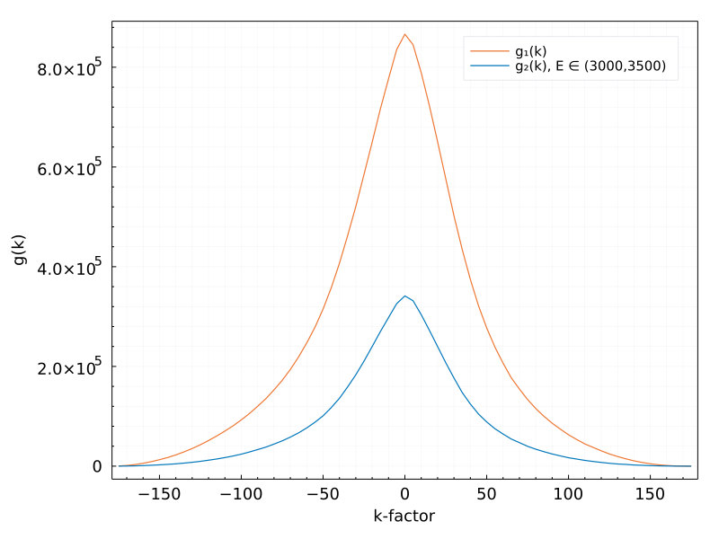
    


### The first thing to notice is the reduced statistics. (For obvious reasons.) The more interesting however, is to look at the dispersion around the k = 0 line. Ideally, the statistics would be sacrified for the improved reconstruction precision -> narrower g(k). This we can better view by looking at $g_1(k), g_2(k)$ normalized by their maximum.  


```julia
gMax1 = maximum(gs1)
gMax2 = maximum(gs2)
plot(ks1  .* dθ, gs1 ./ gMax1, legend=:topright, xlims=(-179, 179), xlabel="k-factor", ylabel="g(k)", label="g₁(k)_relative")
plot!(ks2 .* dθ, gs2 ./ gMax2, legend=:topright, xlims=(-179, 179), xlabel="k-factor", ylabel="g(k)", label="g₂(k)_relative")
```


    
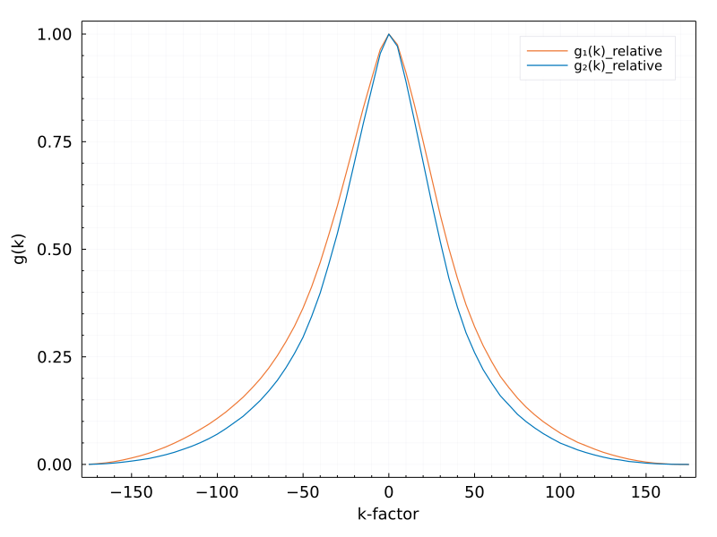
    


### We can see that while applying an energy cut on the data results in decreased statistics, it did provide for a better reconstruction precision. We thus have a tool for comparing the effects of data cuts on the data.

### Next we look more in detail at the individual $\phi$ slices. We first slice up ``f(ϕ, θ)`` horizontally in slices of $d\phi$ = 1 \deg``. We look at the ``g(k)``s of the individual slices.  


```julia
dθ = 5
sign = "p"
maxSteps = Int(180 / dθ)
```


    36


```julia
labels = []                               # initialize array for labels
fh2ds = Array{Hist2D, 1}                  # initialize array of Hist2D object (each slice gets one)
```


    Vector{Hist2D} (alias for Array{Hist2D, 1})


### Initialize arrays to hold the g(k) integrals.


```julia
gs = [] # standard g(k)
ks = [] # goes from -179 to 179

gs_cdf = [] # g(k) but instead of integral it is a cummulative integration
```


    Any[]


```julia
for (i, n) in enumerate(1:dθ:180)
    cutEdges1 = get_cut_edges(n - 1, 1, dθ, sign)                   # provides the lower and upper cut 

    sdf = @chain tree begin                                         # filter out the dataframe
        @subset((cutEdges1[1] .<= :thetaEscaped .<= cutEdges1[2]))
        @select(:thetaEscaped, :thetaEmitted)
    end

    push!(labels, string(
        "θ ∈ (",
        cutEdges1[1],
        ", ",
        cutEdges1[2],
        " )",
    ))

    fh2ds = Hist2D(
        (sdf[!, :thetaEmitted], sdf[!, :thetaEscaped]),
        (minAngle:dEmitted:maxAngle, minAngle:dEmitted:maxAngle),
    )

    push!(gs, get_diagonal_sums(fh2ds))
    push!(ks, get_k_factors(fh2ds))
    push!(gs_cdf, get_diagonal_sums_cdf(fh2ds))
end
```

### We can look at the individual lines of ``g(k)``


```julia
plot(ks,gs)
```


    
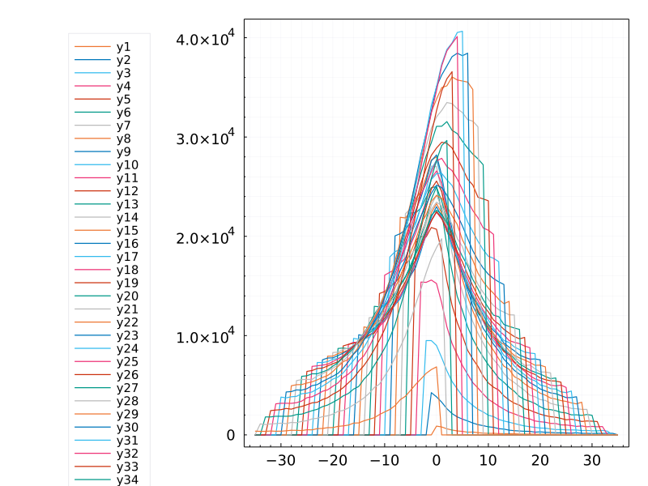
    


### Not much to see in this example. So many lines are difficult to decipher. However, if one were to look at the individual $d\phi$ cuts as a new dimension, we can look at the graph in the plane of $(k, d\phi)$ with z-direction being the value of $g(k, d\phi)$. 


```julia
yMax, xMax = Int(180 / dθ - 1), Int(180 / dθ - 1)
x = -xMax:1:xMax
y = 0:yMax
contourStep = 0.1

z = zeros(length(y), length(x))   # create matrix that represents the g(k, dϕ) values
for c in eachindex(x)
    for r in eachindex(y)
        z[r, c] = get_gs(y[r], x[c], gs)
    end
end
```


```julia
c1 = plot(
    x .* dθ,
    y .* dθ,
    z;
    ylims = (0, 180),
    yticks = 0:30:180,
    xlabel = "k",
    ylabel = "ϕ",
    zlabel = "g(k, dϕ)",
    legend = :none,
    title = string("dϕ= ", dθ, "° "),
    dpi = 150,
    linetype = :surface,
)
c2 = plot(
    x .* dθ,
    y .* dθ,
    z;
    ylims = (0, 180),
    yticks = 0:30:180,
    xlabel = "k",
    ylabel = "ϕ",
    legend = :none,
    title = string("dϕ= ", dθ, "° "),
    dpi = 150,
    linetype = :contourf,
)
vline!([0], label = "", c = :black, l2 = 4)

plot(c1,c2, size = (1000, 400))

```


    
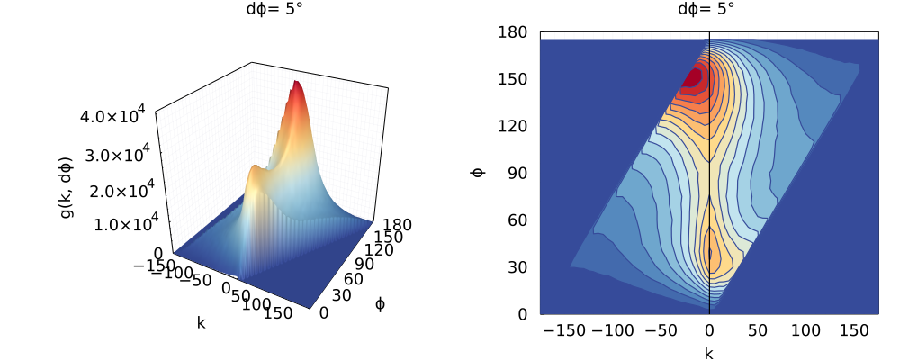
    


### 

### Now we can see a few important features. First of all, on the left figure, there are two peaks visible, with the higher peak (more statistics) being in the region of $\phi > 120$ . Secondly, on the right figure we can see the deviation of the peaks from the `` k = 0`` line. There are two hotspots visible. First hotspot (corresponding to the lower peak in left figure) is centered around $d\phi \approx 30 \deg$ and is shifted slightly to the right of the ``k = 0`` line. The escaped angle overestimates the emitted angle. Second hotspot (corresponding to the higher peak in left figure) is centered around $d\phi \approx 150 \deg$ and is shifted visibly to the left of the ``k = 0`` line. The escaped angle underestimates the emitted angle. Lastly, we can see that the regions $\phi \approx 0 \deg$ and $\phi \approx 180 \deg$ are squeezed toward higher, lower angles, respectively. 

### Furthermore, we can look at the ``g(k)`` calculated as a cummulative integration. Cummulative sum is made over the diagonals from 179 to -179. (This might change later, but I'm not sure if it's needed) 


```julia
z = zeros(length(y), length(x))
for c in eachindex(x)
    for r in eachindex(y)
        z[r, c] = get_gs(y[r], x[c], gs_cdf)
    end
end

```


```julia
c2 = plot(
    x .* dθ,
    y .* dθ,
    z;
    ylims = (0, 180),
    yticks = 0:30:180,
    xlabel = "k",
    ylabel = "ϕ",
    legend = :none,
    title = string("dϕ= ", dθ, "° "),
    dpi = 150,
    linetype = :contourf,
    levels = 0:contourStep:1,
    contour_labels = true,
)
vline!([0], label = "", c = :black, l2 = 4)

```


    
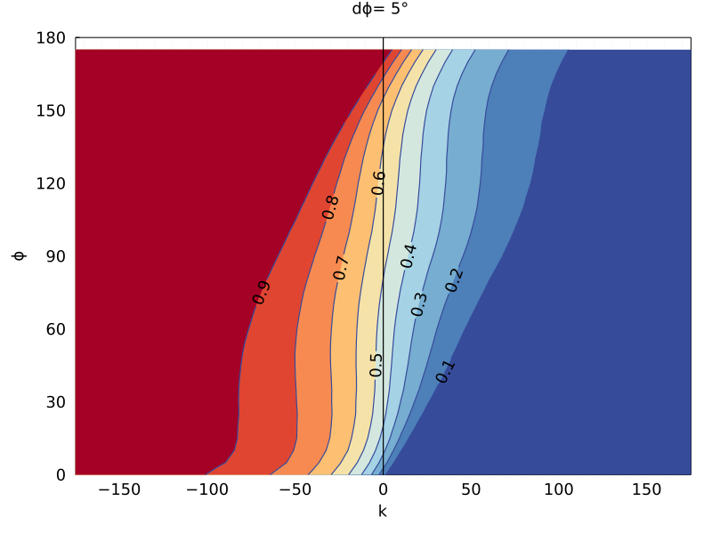
    


### In this figure we can see the cummulative distribution of the $g(k, d\phi)$. We can now take a look, for example, by how much the 50% of the statistics is shifted from ``k=0`` line for each $d\phi$.


```julia
halfPoints = [ks[1][argmin(map( x -> abs(0.5 - x), g ))] * dθ for g in gs_cdf] 

scatter(xPts, halfPoints, xlabel = "dϕ", ylabel = "50% stat" )
```


    
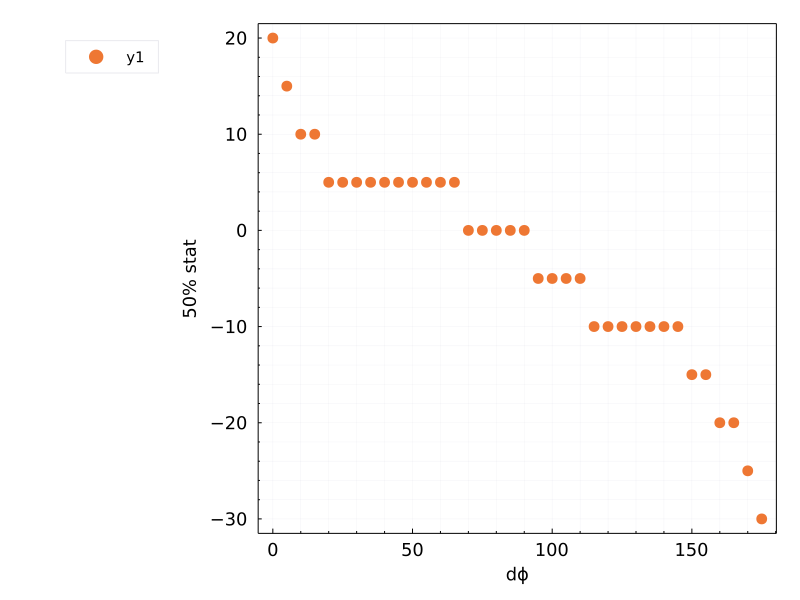
    


```julia
modTree = @chain tree begin
    @select(:thetaEmitted, :thetaEscaped)
    @rtransform :thetaEscapedModified = shift_angle( :thetaEscaped, halfPoints )
    @rtransform :shift_angle2 = :thetaEscaped - shift_angle( :thetaEscaped, halfPoints )
    @subset( 0 .<= :thetaEscapedModified .<= 180 )
end
```


<div class="data-frame"><p>14,675,804 rows × 4 columns</p><table class="data-frame"><thead><tr><th></th><th>thetaEmitted</th><th>thetaEscaped</th><th>thetaEscapedModified</th><th>shift_angle2</th></tr><tr><th></th><th title="Float64">Float64</th><th title="Float64">Float64</th><th title="Float64">Float64</th><th title="Float64">Float64</th></tr></thead><tbody><tr><th>1</th><td>89.6031</td><td>94.6325</td><td>94.6325</td><td>0.0</td></tr><tr><th>2</th><td>96.965</td><td>139.497</td><td>149.497</td><td>-10.0</td></tr><tr><th>3</th><td>154.233</td><td>138.388</td><td>148.388</td><td>-10.0</td></tr><tr><th>4</th><td>67.3403</td><td>154.281</td><td>169.281</td><td>-15.0</td></tr><tr><th>5</th><td>11.2133</td><td>53.0724</td><td>48.0724</td><td>5.0</td></tr><tr><th>6</th><td>168.417</td><td>81.0901</td><td>81.0901</td><td>0.0</td></tr><tr><th>7</th><td>122.632</td><td>69.6012</td><td>64.6012</td><td>5.0</td></tr><tr><th>8</th><td>4.96695</td><td>34.9839</td><td>29.9839</td><td>5.0</td></tr><tr><th>9</th><td>79.857</td><td>61.1214</td><td>56.1214</td><td>5.0</td></tr><tr><th>10</th><td>43.0942</td><td>33.994</td><td>28.994</td><td>5.0</td></tr><tr><th>11</th><td>35.1387</td><td>104.069</td><td>109.069</td><td>-5.0</td></tr><tr><th>12</th><td>150.65</td><td>101.923</td><td>106.923</td><td>-5.0</td></tr><tr><th>13</th><td>56.3877</td><td>55.6631</td><td>50.6631</td><td>5.0</td></tr><tr><th>14</th><td>128.995</td><td>94.8403</td><td>94.8403</td><td>0.0</td></tr><tr><th>15</th><td>63.2692</td><td>40.9504</td><td>35.9504</td><td>5.0</td></tr><tr><th>16</th><td>40.4733</td><td>55.1476</td><td>50.1476</td><td>5.0</td></tr><tr><th>17</th><td>124.468</td><td>142.771</td><td>152.771</td><td>-10.0</td></tr><tr><th>18</th><td>128.263</td><td>20.8424</td><td>15.8424</td><td>5.0</td></tr><tr><th>19</th><td>142.67</td><td>112.558</td><td>117.558</td><td>-5.0</td></tr><tr><th>20</th><td>68.2757</td><td>81.6263</td><td>81.6263</td><td>0.0</td></tr><tr><th>&vellip;</th><td>&vellip;</td><td>&vellip;</td><td>&vellip;</td><td>&vellip;</td></tr></tbody></table></div>


```julia
histogram2d(modTree.thetaEmitted, modTree.thetaEscapedModified,
    nbins        = (nBins, nBins),
    xlabel       = "θemitted -> θ",
    ylabel       = "θescaped -> ϕ",
    legend       = :topright,
    title        = string("f(ϕ, θ): E ∈ (3000, 3500)keV, ", nrow(modTree), " entries"),
    lims         = (0, 180),
    aspect_ratio = 1,)
plot!(xPts, xPts, label ="")
```


    
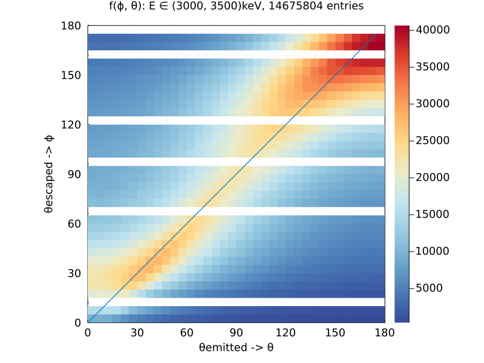
    


### Some of the $d\phi$ lines are empty in the histgoram. This is due to the "discrete" nature of the 50% gs_cdf, some angles are shifted by more than 5 degrees leaving the bin empty. We can look again at the ``g(k)`` plots and see whether the applied shift was successfull. 


```julia
gs = [] # standard g(k)
ks = [] # goes from -179 to 179

gs_cdf = [] # g(k) but instead of integral it is a cummulative integration

for (i, n) in enumerate(1:dθ:180)
    cutEdges1 = get_cut_edges(n - 1, 1, dθ, sign)                   # provides the lower and upper cut 

    sdf = @chain modTree begin                                         # filter out the dataframe
        @subset((cutEdges1[1] .<= :thetaEscapedModified .<= cutEdges1[2]))
        @select(:thetaEscapedModified, :thetaEmitted)
    end

    push!(labels, string(
        "θ ∈ (",
        cutEdges1[1],
        ", ",
        cutEdges1[2],
        " )",
    ))

    fh2ds = Hist2D(
        (sdf[!, :thetaEmitted], sdf[!, :thetaEscapedModified]),
        (minAngle:dEmitted:maxAngle, minAngle:dEmitted:maxAngle),
    )

    push!(gs, get_diagonal_sums(fh2ds))
    push!(ks, get_k_factors(fh2ds))
    push!(gs_cdf, get_diagonal_sums_cdf(fh2ds))
end


z = zeros(length(y), length(x))   # create matrix that represents the g(k, dϕ) values
for c in eachindex(x)
    for r in eachindex(y)
        z[r, c] = get_gs(y[r], x[c], gs)
    end
end

c3 = plot(
    x .* dθ,
    y .* dθ,
    z;
    ylims = (0, 180),
    yticks = 0:30:180,
    xlabel = "k",
    ylabel = "ϕ",
    zlabel = "g(k, dϕ)",
    legend = :none,
    title = string("dϕ= ", dθ, "° "),
    dpi = 150,
    linetype = :surface,
)
c4 = plot(
    x .* dθ,
    y .* dθ,
    z;
    ylims = (0, 180),
    yticks = 0:30:180,
    xlabel = "k",
    ylabel = "ϕ",
    legend = :none,
    title = string("dϕ= ", dθ, "° "),
    dpi = 150,
    linetype = :contourf,
)
vline!([0], label = "", c = :black, l2 = 4)

plot(c3,c4, size = (1000, 400), title = "modified by cumulative 50% shift")
```


    
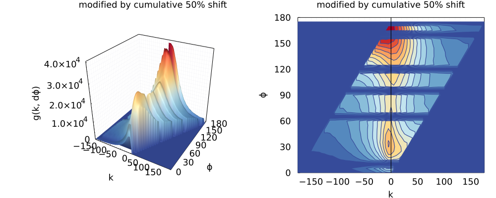
    


```julia
plot(c1,c2, size = (1000, 400), title = " original")
```


    
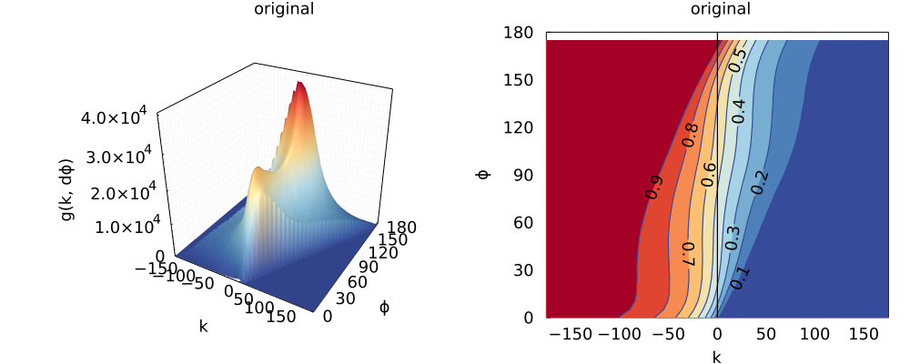
    


### It can be seen that a slight shift toward the `` k = 0 `` line has been achieved. 

### Same shifting procedure can be done using the mean of each ``g(k)``, hopefully getting an even better performance. 


```julia
gs = [] # standard g(k)
ks = [] # goes from -179 to 179

gs_cdf = [] # g(k) but instead of integral it is a cummulative integration

for (i, n) in enumerate(1:dθ:180)
    cutEdges1 = get_cut_edges(n - 1, 1, dθ, sign)                   # provides the lower and upper cut 

    sdf = @chain tree begin                                         # filter out the dataframe
        @subset((cutEdges1[1] .<= :thetaEscaped .<= cutEdges1[2]))
        @select(:thetaEscaped, :thetaEmitted)
    end

    push!(labels, string(
        "θ ∈ (",
        cutEdges1[1],
        ", ",
        cutEdges1[2],
        " )",
    ))

    fh2ds = Hist2D(
        (sdf[!, :thetaEmitted], sdf[!, :thetaEscaped]),
        (minAngle:dEmitted:maxAngle, minAngle:dEmitted:maxAngle),
    )

    push!(gs, get_diagonal_sums(fh2ds))
    push!(ks, get_k_factors(fh2ds))
    push!(gs_cdf, get_diagonal_sums_cdf(fh2ds))
end
```


```julia
shiftPoints = [get_gs_mean(g, ks[1]) for g in gs ]      # find mean of each g(k) and save in vector

scatter(xPts, shiftPoints, xlabel = "dϕ", ylabel = "mean" )
```


    

    


```julia
modTree = @chain tree begin
    @select(:thetaEmitted, :thetaEscaped)
    @rtransform :thetaEscapedModified = shift_angle( :thetaEscaped, shiftPoints )
    @rtransform :shift_angle2 = :thetaEscaped - shift_angle( :thetaEscaped, shiftPoints )
    @subset( 0 .<= :thetaEscapedModified .<= 180)
end

```


<div class="data-frame"><p>15,588,576 rows × 4 columns</p><table class="data-frame"><thead><tr><th></th><th>thetaEmitted</th><th>thetaEscaped</th><th>thetaEscapedModified</th><th>shift_angle2</th></tr><tr><th></th><th title="Float64">Float64</th><th title="Float64">Float64</th><th title="Float64">Float64</th><th title="Float64">Float64</th></tr></thead><tbody><tr><th>1</th><td>89.6031</td><td>94.6325</td><td>94.7675</td><td>-0.135056</td></tr><tr><th>2</th><td>96.965</td><td>139.497</td><td>143.014</td><td>-3.51672</td></tr><tr><th>3</th><td>154.233</td><td>138.388</td><td>141.904</td><td>-3.51672</td></tr><tr><th>4</th><td>67.3403</td><td>154.281</td><td>158.979</td><td>-4.69818</td></tr><tr><th>5</th><td>11.2133</td><td>53.0724</td><td>50.0737</td><td>2.99869</td></tr><tr><th>6</th><td>168.417</td><td>81.0901</td><td>80.2521</td><td>0.838057</td></tr><tr><th>7</th><td>122.632</td><td>69.6012</td><td>67.5257</td><td>2.07542</td></tr><tr><th>8</th><td>4.96695</td><td>34.9839</td><td>30.9861</td><td>3.9978</td></tr><tr><th>9</th><td>79.857</td><td>61.1214</td><td>58.7032</td><td>2.41823</td></tr><tr><th>10</th><td>43.0942</td><td>33.994</td><td>29.9962</td><td>3.9978</td></tr><tr><th>11</th><td>35.1387</td><td>104.069</td><td>105.154</td><td>-1.08454</td></tr><tr><th>12</th><td>150.65</td><td>101.923</td><td>103.008</td><td>-1.08454</td></tr><tr><th>13</th><td>56.3877</td><td>55.6631</td><td>52.941</td><td>2.72204</td></tr><tr><th>14</th><td>128.995</td><td>94.8403</td><td>94.9754</td><td>-0.135056</td></tr><tr><th>15</th><td>63.2692</td><td>40.9504</td><td>37.468</td><td>3.48244</td></tr><tr><th>16</th><td>40.4733</td><td>55.1476</td><td>52.4255</td><td>2.72204</td></tr><tr><th>17</th><td>124.468</td><td>142.771</td><td>146.63</td><td>-3.8588</td></tr><tr><th>18</th><td>128.263</td><td>20.8424</td><td>16.2253</td><td>4.61701</td></tr><tr><th>19</th><td>105.706</td><td>172.673</td><td>179.987</td><td>-7.31367</td></tr><tr><th>20</th><td>142.67</td><td>112.558</td><td>114.446</td><td>-1.88783</td></tr><tr><th>&vellip;</th><td>&vellip;</td><td>&vellip;</td><td>&vellip;</td><td>&vellip;</td></tr></tbody></table></div>


```julia
histogram2d(modTree.thetaEmitted, modTree.thetaEscapedModified,
    nbins        = (nBins, nBins),
    xlabel       = "θemitted -> θ",
    ylabel       = "θescaped -> ϕ",
    legend       = :topright,
    title        = string("f(ϕ, θ): E ∈ (3000, 3500)keV, ", nrow(modTree), " entries"),
    lims         = (0, 180),
    aspect_ratio = 1,)
plot!(xPts, xPts, label ="")
```


    
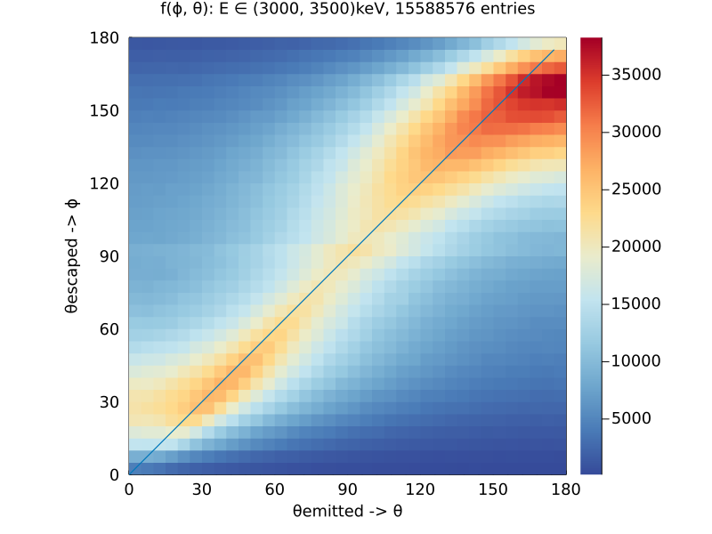
    


```julia
gs = [] # standard g(k)
ks = [] # goes from -179 to 179

gs_cdf = [] # g(k) but instead of integral it is a cummulative integration

for (i, n) in enumerate(1:dθ:180)
    cutEdges1 = get_cut_edges(n - 1, 1, dθ, sign)                   # provides the lower and upper cut 

    sdf = @chain modTree begin                                         # filter out the dataframe
        @subset((cutEdges1[1] .<= :thetaEscapedModified .<= cutEdges1[2]))
        @select(:thetaEscapedModified, :thetaEmitted)
    end

    push!(labels, string(
        "θ ∈ (",
        cutEdges1[1],
        ", ",
        cutEdges1[2],
        " )",
    ))

    fh2ds = Hist2D(
        (sdf[!, :thetaEmitted], sdf[!, :thetaEscapedModified]),
        (minAngle:dEmitted:maxAngle, minAngle:dEmitted:maxAngle),
    )

    push!(gs, get_diagonal_sums(fh2ds))
    push!(ks, get_k_factors(fh2ds))
    push!(gs_cdf, get_diagonal_sums_cdf(fh2ds))
end


z = zeros(length(y), length(x))   # create matrix that represents the g(k, dϕ) values
for c in eachindex(x)
    for r in eachindex(y)
        z[r, c] = get_gs(y[r], x[c], gs)
    end
end


```


```julia
c3 = plot(
    x .* dθ,
    y .* dθ,
    z;
    ylims = (0, 180),
    yticks = 0:30:180,
    xlabel = "k",
    ylabel = "ϕ",
    zlabel = "g(k, dϕ)",
    legend = :none,
    title = string("dϕ= ", dθ, "° "),
    dpi = 150,
    linetype = :surface,
)
c4 = plot(
    x .* dθ,
    y .* dθ,
    z;
    ylims = (0, 180),
    yticks = 0:30:180,
    xlabel = "k",
    ylabel = "ϕ",
    legend = :none,
    title = string("dϕ= ", dθ, "° "),
    dpi = 150,
    linetype = :contourf,
)
vline!([0], label = "", c = :black, l2 = 4)

plot(c3,c4, size = (1000, 400), title = "modified mean")
```


    
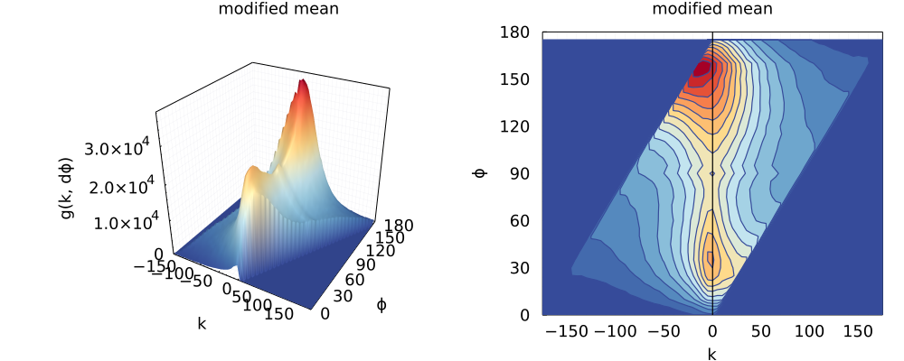
    


```julia
plot(c1,c2, size = (1000, 400), title = " original")
```


    

    


```julia

```
